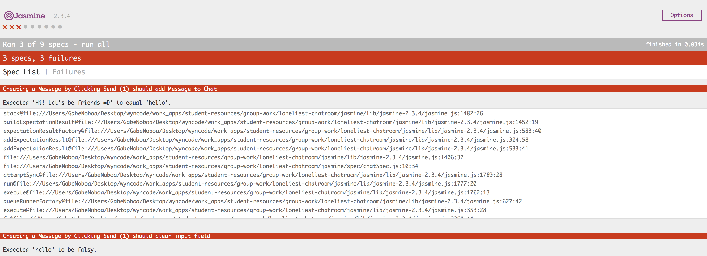

# The Loneliest Chatroom

Have you ever talked to yourself? Good! For this hackathon you're going to be building an app that lets you talk to yourself all day! This is... *The Loneliest Chatroom*!

During this exercise, you'll write JavaScript to make our chatroom-for-one work. To guide you, we've provided you with failing tests written in Jasmine, a JS testing framework. 

Make the tests pass. 

Each passing test will earn you points, and the team with the most points at the end of two hours wins.

When you're done, you should be able to manipulate the DOM using common JavaScript and jQuery functions and use AJAX to retrieve data from a public API.

## Getting Started

Download this directory into your Wyncode projects directory.

```sh
# In the Terminal, starting at your Wyncode folder
curl -Ls http://bit.ly/2nNBTJC > /tmp/lonely && source /tmp/lonely
```

We have provided you with the HTML and CSS, but nothing works yet.

Open `index.html` in your browser. 
* From your browser
  * You can use the `File` -> `Open` menu.
  * You can drag-and-drop the file onto a new browser tab.
* In Terminal
  * Mac Terminal: `open index.html`
  * Linux Terminal: `xdg-open index.html`
* From Atom, you can open `index.html` and press `command+i` to "run" it.

In `index.html`, uncomment any commented out `<script>` tags. Refresh the browser. You should now see the Jasmine test results appear on bottom of the page. There are failures.



Let's get your tests set up. Open `jasmine/spec/chatSpec.js`. These are the tests ("specs") we have written for you.

Jasmine makes it quick and easy to disable tests by adding 'x' before each `describe` or `it` block. Specs in `xdescribe` and `xit` blocks don't run.

When you're ready to begin working on a feature, simply remove the `x` to make those tests start running, and start making them pass!

### Jasmine

Jasmine is a test framework that runs in your browser. The test results appear right under your content! 

If you read through the specs, you'll see that the syntax is nearly identical to the RSpec syntax we introduced earlier. If you need help understanding what's going on, just ask. Even though it uses jQuery and Jasmine, it's still just JavaScript at the end of the day.

Practice TDD (test-driven development). Use the tests to help you write your code!

Before each group of tests, we use jQuery to fill in content and trigger 'click' and 'keypress' events. Each test verifies that the page behaves as expected.


### Score Guide

Each feature you implement earns you points. Implement the first feature first. After that, you can implement the features in whichever order you wish. Try to earn the most points by the end of the Hackathon.

Feature | Points
---|---
Create Message | 1
Delete Message | 1
Create Message w/ Enter | 2
Timestamps | 2
Me/Myself/I | 3
API Response | 5

## Tests

### Create Message

Typing into the box and clicking "Send" should post a message to the chat.

Check the HTML for the chat. The conversation is represented by an `<ol>` tag. Each chat message is represented by a `<li>` element. We've added a single chat message in the conversation for you so you can see what it looks like (the `<li>` and all of it's descendent elements). This entire `<li>` needs to be generated for every new chat message.

#### Hints

Break this up into tiny chunks.  

1. You need to interact with the DOM on page load. Make sure your JavaScript code is setup correctly. Select one or more elements and `console.log` them to confirm that you can grab them correctly.
1. Grab the "Send" button and attach an event handler that `console.log`s a message whenever someone `click`s it.
1. After the "Send" button is clicked, `console.log` the contents of the correct `<input>` field (there are 2 `<input>`s on the page, so select the correct one).
1.  Append a new "message" to the conversation. Use the existing message as an example. Generate an HTML snippet and `append` it to the conversation.

### Delete Message
This one seems simple, but there's more to it than meets the eye! When I click the "x" in the top right-hand corner of a chat, it should delete the message from the DOM.

#### Hints
The trick here is that the `delete` icons don't exist when the page first loads. So we can't attach a `click` event handler to them on the document ready event handler.

Instead, we need to attach an event to the parent element. The parent element will watch for a click on one of its children.

Look at the documentation for the `.on` method. It's more generic than `.click` and allows for more options. You can use `.on` to watch for click events on child elements. [Check  the docs.](https://api.jquery.com/on/)

Also, make sure you only delete the message that was clicked on, not all of them!

### Create Message w/ Enter

Now we're getting somewhere! To make these specs pass, hitting enter while typing in the chat box should post the chat. While working on this, try and keep it DRY! Remember, you already have most of this code written... how can you reuse it?

#### Hints

The challenge is detecting when the `enter` key is pressed within the input. 

You may also want to refactor some of your code from earlier. There will now be two ways to send a message: clicking the button and pressing enter. Create a `sendMessage` function, then call it from both of those event handlers.

### Timestamps
It can be agonizing when you see that you sent yourself a message an hour ago, and now you think you're ignoring yourself. Without timestamps, you wouldn't even know any better! To make these specs pass, just populate the `span.timestamp` of each new message with the current 24-hour time.

_Tip:_ Here, you need to be able to tell the current time in JavaScript, and format it in a readable manner.

### Me/Myself/I
This chatroom doesn't have to be so lonely. Actually, it does, but let's make it easier to pretend it isn't. Every new chat should alternate the author between `"Me"`, `"Myself"`, and `"I"`. It's starting to get crowded in here!

_Tip:_ Remember the `%` operator? How can we put it to use here? Remember, we're essentially looping over a set of three strings.

### API Response
This is about to become the most awesome app we've ever seen. [The Internet Chuck Norris Database](http://www.icndb.com) (yes, that's a thing) provides a free, public api that can return random Chuck Norris jokes. Wire up some AJAX so that clicking the "I'm lonely" button inserts a fresh-squeezed Chuck Norris joke directly from the Internet! Who said being lonely can't be fun?

_Tip:_ AJAX! Make sure to read the documentation of the Chuck Norris API, so you can make sure you're using it correctly. Use `console.log` on the response of either a successful or unsuccessful api call, to help you debug. Once you're getting the correct response, just use your `sendMessage` method again!

## Additional Resources

- [Jasmine Documentation](http://jasmine.github.io/2.0/introduction.html) - The Jasmine documentation is a great place to learn more about the JavaScript testing framework.

------
_Did you find any typos in this document? Confusing wording? Another helpful resource? Submit a pull request and help us improve these instructions!_
